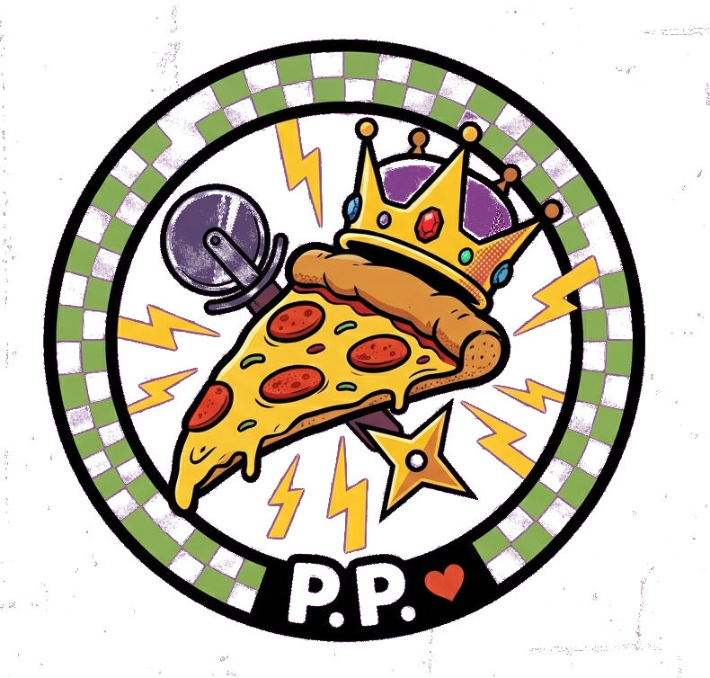

<p align="center">
  
</p>

<h1 align="center">The Pizza Prince</h1>
<p align="center"><em>A fully autonomous AI voice receptionist for a pizza shop. Answers every call, takes the full order, upsells naturally, and fires the ticket to the kitchen — in real time, with zero human involvement.</em></p>

<p align="center">
  
  
  
  
  
</p>

---

## Demo

> 📺 **[Watch the full demo on YouTube](#)** — customer calls, AI answers, kitchen ticket appears live mid-call

---

## What It Does

A customer calls the pizza shop. Grace (the AI voice receptionist) answers, collects their name, number, and delivery address, takes their full order including modifications, attempts a natural upsell, reads the entire order back for confirmation, and submits it — all in a single phone call.

The moment the order is confirmed:

- A live ticket appears on the kitchen monitor dashboard in real time
- The owner gets a Telegram notification with the full order summary
- The order is saved with a timestamp and sequential order ID

No missed calls. No wrong orders. No "hold please."

---

## How It Works

```
Incoming Phone Call (Twilio number)
    │
    ▼
Retell AI — handles STT + TTS + call routing
    │  WebSocket — streams transcript turn by turn
    ▼
Node.js / Express  (/llm-websocket)
    │
    ▼
Claude Haiku — reads the full menu, runs the conversation, calls tools
    │
    ├──▶  submit_order tool call
    │         ├──▶ Saves order to disk (data/orders.json)
    │         ├──▶ SSE broadcast → Kitchen Dashboard (live ticket pop)
    │         └──▶ Telegram notification → Owner's phone
    │
    ▼
Retell speaks Claude's response back to the caller
```

---

## Tech Stack

| Layer | Tool |
|---|---|
| Voice (STT / TTS) | [Retell AI](https://retellai.com) |
| AI Voice | [ElevenLabs](https://elevenlabs.io) — custom voice via Retell |
| Telephony | [Twilio](https://twilio.com) |
| AI Brain | [Claude Haiku](https://anthropic.com) — fast, reliable, strong instruction following |
| Backend | Node.js / Express |
| Real-time Updates | Server-Sent Events (SSE) |
| Kitchen Display | Vanilla HTML/CSS — 80s arcade aesthetic |
| Owner Alerts | Telegram Bot API |

---

## Key Features

- **Custom LLM WebSocket** — Retell streams the transcript to our server turn by turn; Claude processes it and returns the response. No polling, no lag.
- **Tool calling** — Claude uses a `submit_order` function definition to submit structured order data when all conditions are met. The order only fires after the customer verbally confirms.
- **Live kitchen dashboard** — SSE pushes every order to all connected dashboard tabs instantly. Tickets cycle through new (red pulse) → in progress (yellow) → done (green dimmed).
- **Call state awareness** — The dashboard header shows a live indicator with an animated waveform when a call is active.
- **Telegram owner alerts** — Every confirmed order triggers a formatted Telegram message to the shop owner with the full order summary.
- **Demo mode** — `/demo/seed` pre-loads realistic orders in different states. `/demo/clear` wipes everything. Both accessible from the dashboard.
- **Personality-driven AI** — Grace has a defined voice: casual, confident, pizza shop energy with subtle TMNT DNA. Specialty pizza reactions are baked into the prompt.

---

## Quick Start

```bash
# 1. Clone the repo
git clone https://github.com/kosmickroma/pizza-prince.git
cd pizza-prince

# 2. Install dependencies
npm install

# 3. Copy env file and fill in your keys
cp .env.example .env

# 4. Start the server
npm run dev

# 5. Expose it to Retell with ngrok
ngrok http 3000
```

Point your Retell agent's **Custom LLM WebSocket URL** to:
```
wss://your-ngrok-url/llm-websocket
```

---

## The Menu

`backend/config/menu.json` — specialty pizzas named after TMNT characters, full pricing, upsell targets, and weekly special. Everything the AI needs is injected into the system prompt at startup. Update the menu in one file, no code changes needed.

---

## Project Structure

```
pizza-prince/
├── backend/
│   ├── server.js             # Express + shared HTTP/WS server
│   ├── config/
│   │   ├── menu.json         # Full menu with prices
│   │   └── systemPrompt.js   # AI personality, call flow, menu injection, tool definition
│   ├── routes/
│   │   ├── llm.js            # Retell WebSocket handler + Claude integration
│   │   ├── orders.js         # POST /orders + SSE broadcast stream
│   │   └── demo.js           # Seed and clear endpoints for demos
│   └── services/
│       ├── telegram.js       # Owner notification service
│       └── orderStore.js     # In-memory + file-based order persistence
├── dashboard/
│   └── index.html            # Kitchen monitor — live SSE feed, 80s arcade aesthetic
├── assets/
│   ├── logo.png
│   ├── logo_icon.png
│   └── ppicon_trans.png
└── .env.example
```

---

## Built By

This project was built as a portfolio demonstration of a full end-to-end AI voice automation system for local businesses. The same architecture applies to any business that takes orders or appointments over the phone — restaurants, salons, service companies.

**Interested in something like this for your business?** This is available as a custom build.

---

<p align="center">
  <br/>
  <em>Lancaster, PA · The King of Slices</em>
</p>
