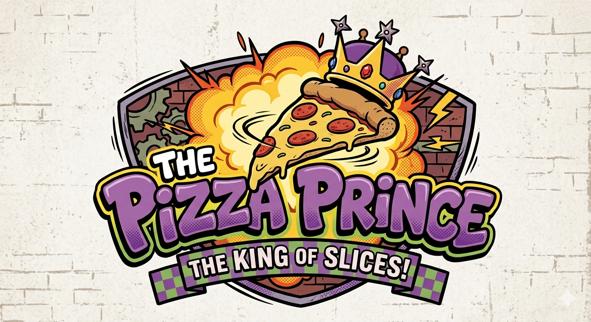
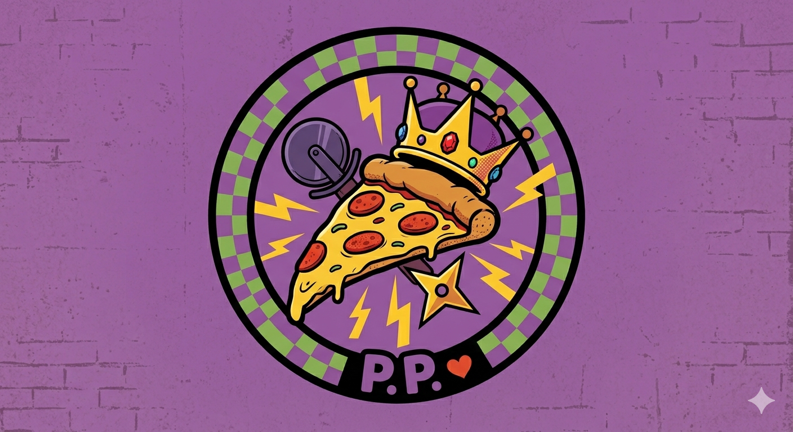

<p align="center">
  
</p>

<h1 align="center">The Pizza Prince</h1>
<p align="center"><em>An AI voice receptionist that answers every call, takes the full order, and fires it to the kitchen in real time. Never miss another Friday night rush.</em></p>

<p align="center">
  
  
  
  
</p>

---

## What It Does

A customer calls the pizza shop. The Pizza Prince AI answers, takes their full order (with upsells), confirms everything back to them, and the moment they hang up:

- The kitchen monitor updates in real time with the new ticket
- The owner gets a Telegram ping with the full order summary
- The order is logged with a timestamp and order ID

No missed calls. No wrong orders. No "hold please."

---

## How It Works

```
Phone Call (Twilio number)
    │
    ▼
Retell AI — handles voice (speech-to-text + text-to-speech)
    │  WebSocket — sends transcript in real time
    ▼
Express Server /llm-websocket
    │
    ▼
Claude Haiku — reads the menu, runs the conversation, calls tools
    │
    ├──▶  submit_order tool
    │         ├──▶ Logs order to data/orders.json
    │         ├──▶ SSE broadcast → Kitchen Dashboard (localhost:3000/dashboard)
    │         └──▶ Telegram ping → Owner's phone
    │
    ▼
Retell AI speaks the response back to the caller
```

---

## Tech Stack

| Layer | Tool |
|---|---|
| Voice (STT/TTS) | [Retell AI](https://retellai.com) |
| Telephony | [Twilio](https://twilio.com) |
| AI Brain | Claude Haiku (fast + cheap for real-time voice) |
| Backend | Node.js / Express |
| Kitchen Display | Custom HTML/CSS + Server-Sent Events |
| Owner Alerts | Telegram Bot API |

---

## Quick Start

```bash
# 1. Clone the repo
git clone https://github.com/kosmickroma/pizza-prince.git
cd pizza-prince

# 2. Install dependencies
npm install

# 3. Copy env file and fill in your keys
cp .env.example .env

# 4. Start the server
npm run dev

# 5. Expose it to Retell with ngrok
ngrok http 3000
```

---

## The Menu

Located at `backend/config/menu.json`. Specialty pizzas are named after TMNT characters because of course they are.

The weekly special updates in one line — no code changes needed.

---

## Project Structure

```
pizza-prince/
├── kktodo/          # Learning templates — commented code to study and copy
├── backend/
│   ├── server.js    # Express entry point
│   ├── config/
│   │   ├── menu.json        # Full menu with prices
│   │   └── systemPrompt.js  # Builds the AI's personality + menu knowledge
│   ├── routes/
│   │   ├── llm.js    # Retell WebSocket endpoint
│   │   ├── orders.js # Order logging + SSE stream
│   │   └── demo.js   # Trigger fake orders for demos
│   └── services/
│       ├── claude.js      # Claude Haiku client
│       ├── telegram.js    # Owner notification
│       └── orderStore.js  # Order persistence
├── dashboard/
│   └── index.html   # Kitchen monitor — 80s aesthetic, live order feed
├── assets/
│   ├── logo.png
│   └── logo_icon.png
└── .env.example
```

---

## The `kktodo/` Folder

This project was built as a learning exercise. The `kktodo/` folder contains every file as a heavily-commented template — written to explain *why* each line exists, not just *what* it does. The actual implementation in `backend/` was written from those templates.

---

<p align="center">
  <br/>
  <em>Named after the Ninja Turtles episode where a turtle had to work off a debt at a pizza shop.<br/>Lancaster, PA · Built with too much caffeine and not enough sleep.</em>
</p>
